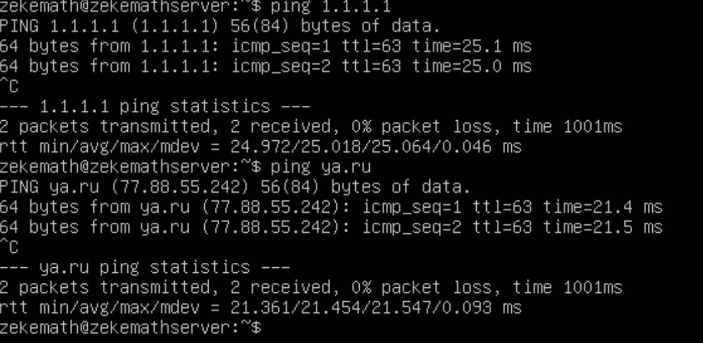
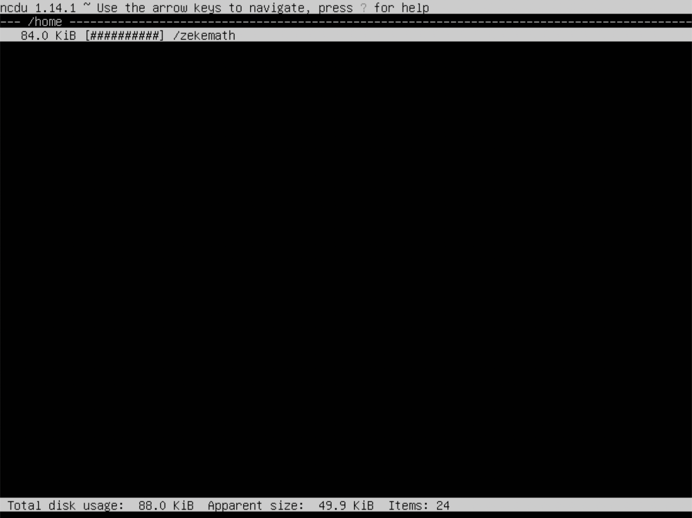

## Part 1. Установка ОС

1. Смотрим версию Ubuntu после установки.

## Part 2. Создание пользователя

1. Вызов команды для создания пользователя. Добавляем его в группу adm.

2. Вывод списка пользователей (новый пользователь указан в конце списка).

## Part 3. Настройка сети ОС

1. Задаем новое имя машины.

2. Устанавливаем временную зону.

3. С помощью консольной команды выводим названия сетевых интерфейсов.

**lo или local loopback (локальная петля)** - используется для того, что-бы компьютер мог обращаться к самому себе и имеет по-умолчанию ip-адрес 127.0.0.1 на всех компьютерах.

4. Получаем ip-адрес от DHCP-сервера.

**DHCP (Dynamic Host Configuration Protocol)** — это протокол автоматической настройки, используемый в IP-сетях. DHCP-сервер может назначать каждому клиенту IP-адрес и информировать клиентов об IP-адресе DNS-сервера и IP-адресе шлюза по умолчанию.

5. Определяем :
   - внешний ip-адрес шлюза

   - внутренний ip-адрес шлюза

6. Задаем статичные настройки ip, gw, dns c помощью 
 изменений в файле sudo vim /etc/netplan/*.yaml
 - применяем изменения в netplan

7. Cохраняем и перезагружаем

 - Убедимся что настройки соответствуют заданным в предыдущем пункте.

8. Успешно пропинговали удаленные хосты 1.1.1.1 и ya.ru

## Part 4. Обновление ОС

1. Обновили системные пакеты

## Part 5. Использование команды **sudo**

**sudo** — команда, которая наделяет правами суперпользователя. Ее используют прежде какой-либо иной команды в консоли для выполнения с правами администратора.
 1. Меняем hostname с помощью нового пользователя с sudo правами

## Part 6. Установка и настройка службы времени 

1.  Вывод команды с текущим временем

## Part 7. Установка и использование текстовых редакторов
1. 
- **VIM** Для выхода с сохранением нажать ESC+:wq

- **JOE** Для выхода с сохранением нажать Ctrl+KX, ввести имя файла и подтвердить

- **NANO** Для выхода с сохранением нажать Ctrl+O, ввеcти имя файла и подтвердить. Нажать Ctrl+X для выхода

2. 
- **VIM** Для выхода без сохранения нажать ESC+:q! 

- **JOE** Для выхода без сохранения нажать Ctrl+С, -> y

- **NANO** Для выхода без сохранения нажать Ctrl+X, -> N

3. 
- **VIM** Для поиска ESC+/*что ищем*

- **VIM** Для замены :s/*что заменить*/*чем заменить*

- **JOE** Для поиска: Ctrl+K-F текстового фрагмента

- **JOE** Для замены: Ctrl+K-F фрагмент котрый заменить -> R -> чем заменить -> Y

- **NANO** Для поиска Ctrl+что ищем

- **NANO** Для замены Ctrl\ -> что заменить -> чем -> Y

## Part 8. Установка и базовая настройка сервиса **SSHD**

1. Установить службу SSHd.
-  выполнить sudo apt-get install ssh
-  выполнить sudo apt install openssh-server
-  выполнить sudo systemctl enable sshd
-  проверить работу SSH с помощью systemctl status sshd
 
  **ps** - выводит статистику и информацию о состоянии процессов в системе, в том числе ИД процесса или нити, объем выполняемого ввода-вывода и используемый объем ресурсов процессора и памяти.
  
  **-e** - позволяет выбрать все процессы
  
  **| grep sshd** - поиск по вводу через пайп

- Перенастроить службу SSHd на порт 2022

- netstat -tan

**-tan**

-a - Показывать состояние всех сокетов; обычно сокеты, используемые серверными процессами, не показываются.

-n - Показывать сетевые адреса как числа. netstat обычно показывает адреса как символы.

-t - Отображать TCP подключения
Столбцы вывода :

Proto - протокол (tcp, udp, raw), используемый сокетом.

Recv-Q - счётчик байтов не скопированных программой пользователя из этого сокета.

Send-Q - счётчик байтов, не подтверждённых удалённым узлом.

Local Address - адрес и номер порта локального конца сокета.

Foreign Address - адрес и номер порта удалённого конца сокета.

State - состояние сокета.

LISTEN - сокет ожидает входящих подключений.

SYN_SENT - сокет, находящийся в режиме активной попытки установки подключения.

0.0.0.0 - немаршрутизируемый адрес IPv4, который используется в качестве адреса по умолчанию или адреса-заполнителя.

## Part 9. Установка и использование утилит **top**, **htop**
  - uptime - 23 min
  - количество авторизованных пользователей - 1 user
  - общую загрузку системы - 0.00 0.00, 0.00
  - общее количество процессов - 93
  - загрузку cpu - 0.3%
  - загрузку памяти - 371.8
  - pid процесса занимающего больше всего памяти - 658 (top -o %MEM)
  - pid процесса, занимающего больше всего процессорного времени - 1240 (top -o %CPU)
  
   **htop**
  - отсортировать по PID PERCENT_CPU, PERCENT_MEM, TIME
  
  - PERCENT_CPU
  
  - PERCENT_MEM
  
  - TIME
  
  - отфильтрованный для процесса sshd
  
  - с процессом syslog, найденным, используя поиск
  
  - с добавленным выводом hostname, clock и uptime
  

## Part 10. Использование утилиты **fdisk**

    название жесткого диске - VBOX HARDDISK
    его размер - 10 GIB
    количество секторов - 20971520
   

    а также размер swap - 1.24GIB
   

## Part 11. Использование утилиты **df** 

**df**:

    размер раздела - 8408452
    размер занятого пространства - 2659164
    размер свободного пространства - 5300572
    процент использования - 34%
    единица измерения в выводе - килобайты

**df -Th**:

    размер раздела - 8.1G
    размер занятого пространства - 2.6G
    размер свободного пространства - 5.1G
    процент использования - 34%
    тип файловой системы для раздела - ext4
    
   

## Part 12. Использование утилиты **du**

1. Размер папок /home, /var, /var/log в байтах
 
2. Размер папок /home, /var, /var/log в человекочитаемом виде
 
3. Размер всего содержимого в /var/log используя *
 

 ## Part 13. Установка и использование утилиты **ncdu**

1. Установка утилиты ncdu
 
2. размер папки /home
 
3. размер папки /var
 
4. размер папки /var/log
 

 ## Part 14. Работа с системными журналами

1. sudo vim /var/log/dmesg
2. sudo vim /var/log/syslog
3. sudo vim /var/log/auth.log 

 - время последней успешной авторизации, имя пользователя и метод входа в систему. (The Jan 20 03:51:01 zekemath by LOGIN)
 - скрин с сообщением о рестарте службы 
 

 ## Part 15. Использование планировщика заданий **CRON**

1. Создание задачи в CRON.

2. Запись в системных журналах о выполнении.
(cat /var/log/syslog | tail -f)

3. Вывели список задач.

4. Удалили все задачи и вывели список.

